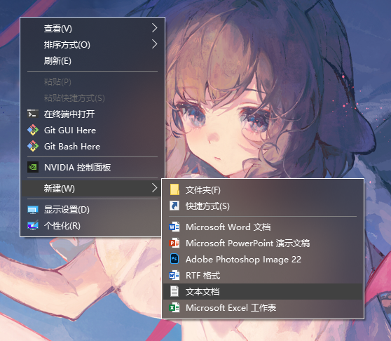
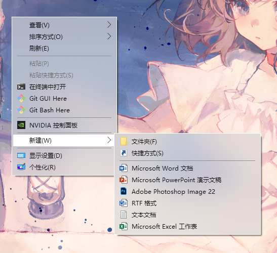
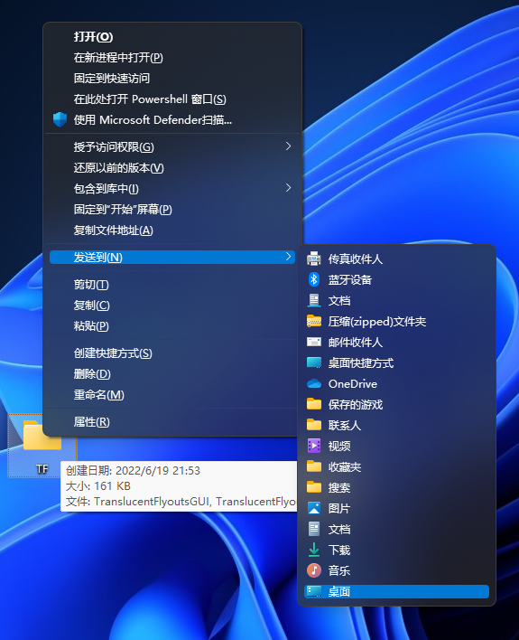
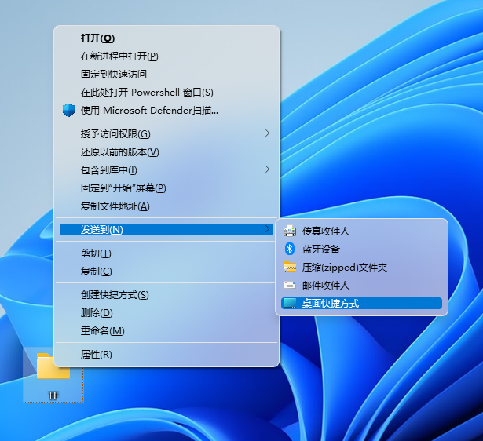

## TranslucentFlyouts
A lightweight utility that makes the Windows flyouts (popup menu, or sth. else) translucent/transparent on Windows 10/11.
## Overview

## Limitations
TranslucentFlyouts cannot blur windows2000 style popup menu and ownerdrawn popup menu
## Dependencies and References
[Detours](https://github.com/microsoft/Detours)
