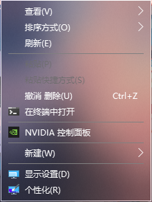

## TranslucentFlyouts
A lightweight utility that makes the Windows flyouts (popup menu, or sth. else) translucent/transparent on Windows 10/11.
## Overview

## Dependencies and References
[Detours](https://github.com/microsoft/Detours)
