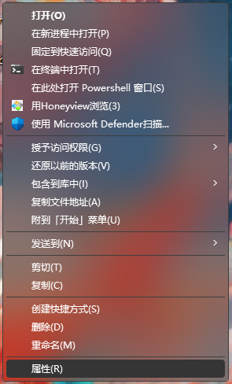
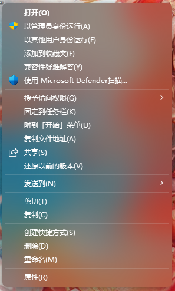
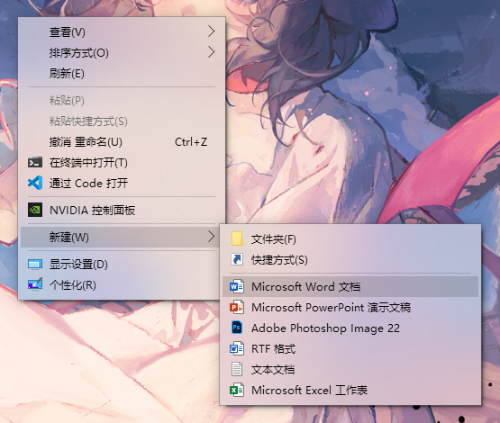
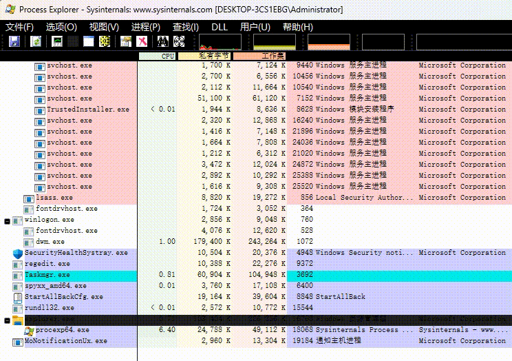
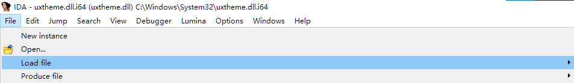
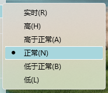

# TranslucentFlyouts V2
An application that makes most of the win32 popup menus translucent/transparent on Windows 10/11, providing more options to tweak it to meet your need.

Compared to V1, TranslucentFlyouts V2 has better compatibility and the ability to customize.   
TranslucentFlyouts V1 has been moved to [TranslucentFlyoutsV1](https://github.com/ALTaleX531/TranslucentFlyoutsV1).   
**TranslucentFlyouts uses [LGNU V3 license](./COPYING.LESSER) started from V2.**  

  

###  Other Languages
[简体中文](./ReadMe/zh-cn.md)  
## Catalog
- [Gallery](#gallery)
- [How to use](#how-to-use)
- [Config](./Config/en-us/CONFIG.md)
- [Limitations & Compatibility](#limitations-and-compatibility)
- [Dependencies & References](#dependencies-and-references)
## Gallery

<b>Acrylic</b>

Windows 10   

Windows 11  

<b>Mica/MicaAlt (Windows 11 Only)</b>

> .png)

<b>Custom Rendering Sample</b>

<b>Fluent Animations</b>

   

   

## How to use

### Install
1. Download the compiled program archive from the [Release](https://github.com/ALTaleX531/TranslucentFlyouts/releases/latest) page.
2. Unzip it to a location such as "`C:\Program Files`".
3. Run "`install.cmd`" as administrator.

> [Note!]:   
> **Downloading symbol files from Microsoft server is required at the first time or after a windows update, otherwise some functionalities will be unavailable!**  

### Uninstall
1. Run "`uninstall.cmd`" as administrator.
2. Delete the remaining files. (It is recommended to logoff before doing it)

## Limitations and Compatibility
### Here are some situations that TranslucentFlyouts will always be automatically disabled.
### 1. Windows 2000 Style popup menu  

Outdated.   
Some third-party applications like `HoneyView` may cause this issue.
### 2. Ownerdrawn popup menu

As you can see, it is a QT popup menu.  
It really looks like the default menu, isn't it?  
But it's rendering procedure is completely different from the defualt one, making TranslucentFlyout hard to modify its visual content.  
### **3. StartAllBack**
`StartAllBack` has built-in support for translucent popup menu, and its rendering procedure priority is higher than TranslucentFlyouts.  
> [Note!]:  
> For this reason, `v2.0.0-alpha.4` and higher versions of TranslucentFlyouts will automatically disable itself when `StartAllBack` was detected, unless there is a way to fully disable `StartAllBack`' s handling procedure.  
> However, TranslucentFlyouts is still available for other applications except `Explorer`.

**It may possibly also cause this issue when StartAllBack is installed**  

   
As you can see there is a white border around the menu item, it will always exist until you disable or uninstall StartAllBack...  
For now, there are two ways to solve this.   
1. Set the dword value `EnableCustomRendering` to non-zero for TranslucentFlyouts.   
Registry path: HKEY_CURRENT_USER\SOFTWARE\TranslucentFlyouts\Menu\EnableCustomRendering
2. Install a custom theme.

## Dependencies and References
### [Microsoft Research Detours Package](https://github.com/microsoft/Detours)  
Detours is a software package for monitoring and instrumenting API calls on Windows.  
### [VC-LTL - An elegant way to compile lighter binaries.](https://github.com/Chuyu-Team/VC-LTL5)  
VC-LTL is an open source CRT library based on the MS VCRT that reduce program binary size and say goodbye to Microsoft runtime DLLs, such as msvcr120.dll, api-ms-win-crt-time-l1-1-0.dll and other dependencies.  
### [Windows Implementation Libraries (WIL)](https://github.com/Microsoft/wil)  
The Windows Implementation Libraries (WIL) is a header-only C++ library created to make life easier for developers on Windows through readable type-safe C++ interfaces for common Windows coding patterns.  