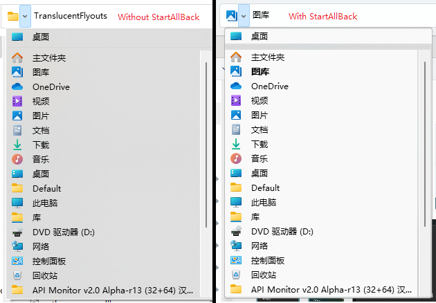

## TranslucentFlyouts V2
一个在Windows10/11让大部分Win32弹出菜单半透明/全透明的应用，致力于提供更多可自定义选项以满足你的需要。

相比于第一版，TranslucentFlyouts V2有着更好的兼容性和稳定性，以及更丰富的可自定义性  
**从TranslucentFlyouts V2开始，该项目使用[LGNU V3 license](/COPYING.LESSER)作为开源许可。**  

[English](../README.md)  
## 目录
- [图库](#gallery)
- [如何使用](#how-to-use)
- [配置文件](../Config/zh-cn.md)
- [一些限制和兼容性相关的问题](#limitations-and-compatibility)
- [依靠和引用](#dependencies-and-references)
## Gallery
图库

<b>Acrylic</b>

Windows 10
> 

Windows 11  
> 

<b>Mica/MicaAlt (仅Windows 11)</b>

> 
.png)

## How to use
如何使用

### 安装
1. 从[Release](https://github.com/ALTaleX531/TranslucentFlyouts/releases/latest)下载已经编译和打包好的程序文件
2. 解压到一个安全的地方比如"`C:\Program Files`"
3. 以管理员身份运行"`install.cmd`"
4. 注销以应用更改

**第一次使用时或系统大版本更新后，TranslucentFlyouts需要从微软服务器下载符号文件，否则一些功能将不可用！**  
cmd: `Rundll32 "你放置的目录/TFMain64.dll",Main /install"`

### 卸载
1. 以管理员身份运行"`uninstall.cmd`"
2. 注销以应用更改
3. 手动删除剩下的文件

cmd: `Rundll32 "你放置的目录/TFMain64.dll",Main /uninstall"`
## Limitations and Compatibility
一些限制和兼容性相关的问题
### 在以下的情况下，TranslucentFlyouts不可用
### 1. Windows 2000 风格的弹出菜单  
> 

老古董
### 2. Ownerdrawn popup menu
> 

如你所见，这是一个QT弹出菜单  
是不是看着挺像系统的那种默认菜单？  
但是它的渲染流程与默认菜单截然不同，使得TranslucentFlyouts很难正确修改它的视觉内容
### **4. StartAllBack**
**你可以将TranslucentFlyouts与StartAllBack一起使用，但你真的需要注意以下情况内容**  
StartAllBack具有对半透明弹出菜单的内置支持，并且它的渲染流程的优先级高过TranslucentFlyouts，所以TranslucentFlyouts会实际上对文件管理器什么都不做。（也许是时候反馈给StartAllBack让它们提供一个彻底关闭这种内置支持的选项！）

**它还可能会造成以下问题当与TranslucentFlyouts一起使用**  
### 1. 菜单高亮项有缺陷
>    
       
如你所见有个白白的边框环绕着高亮的菜单项，它会一直存在直到你禁用或卸载StartAllBack...    
**要想解决这个问题，你需要修改TranslucentFlyouts的注册表信息，将dword值“EnableCustomRendering”设置为非零值**  
注册表路径： HKEY_CURRENT_USER\SOFTWARE\TranslucentFlyouts\Menu\EnableCustomRendering

### 2. 不正常的下拉控件
>      
变得不透明了    
**要想解决这个问题，你需要修改TranslucentFlyouts的注册表信息，将dword值“Disabled”设置为非零值**  
注册表路径： HKEY_CURRENT_USER\SOFTWARE\TranslucentFlyouts\DropDown\Disabled

## Dependencies and References
### [Microsoft Research Detours Package](https://github.com/microsoft/Detours)  
Detours is a software package for monitoring and instrumenting API calls on Windows.  
### [VC-LTL - An elegant way to compile lighter binaries.](https://github.com/Chuyu-Team/VC-LTL5)  
VC-LTL is an open source CRT library based on the MS VCRT that reduce program binary size and say goodbye to Microsoft runtime DLLs, such as msvcr120.dll, api-ms-win-crt-time-l1-1-0.dll and other dependencies.  
### [Windows Implementation Libraries (WIL)](https://github.com/Microsoft/wil)  
The Windows Implementation Libraries (WIL) is a header-only C++ library created to make life easier for developers on Windows through readable type-safe C++ interfaces for common Windows coding patterns.  