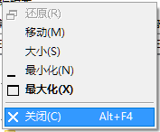

# TranslucentFlyouts V2

一个在Windows10/11让大部分Win32弹出菜单半透明/全透明的应用，致力于提供更多可自定义选项以满足你的需要。

相比于第一版，TranslucentFlyouts V2有着更好的兼容性和稳定性，以及更丰富的可自定义性  
TranslucentFlyouts V1 已经被移动到 [TranslucentFlyoutsV1](https://github.com/ALTaleX531/TranslucentFlyoutsV1).  
**从TranslucentFlyouts V2开始，该项目使用[LGNU V3 license](/COPYING.LESSER)作为开源许可。**  

**我完全在业余时间里开发这个项目，没有任何收益，因此我有可能因学业繁忙不能及时更新它，希望大家能理解**

  

### 其它语言

[English](../README.md)  

## 目录

- [图库](#gallery)
- [如何使用](#how-to-use)
- [如何配置](#how-to-configure)
- [一些限制和兼容性相关的问题](#limitations-and-compatibility)
- [依靠和引用](#dependencies-and-references)

## Gallery

图库

<b>Acrylic 亚克力模糊</b>

Windows 10   

Windows 11  

<b>Mica/MicaAlt 云母 (仅Windows 11)</b>

.png)

<b>自定义渲染的例子</b>

<b>流利的动画</b>

   

   

## How to use

如何使用

### 安装

1. 从[Release](https://github.com/ALTaleX531/TranslucentFlyouts/releases/latest)下载已经编译和打包好的程序文件
2. 解压到一个安全的地方比如"`C:\Program Files`"
3. 以管理员身份运行"`install.cmd`"

> 注意:   
> **第一次使用时或系统大版本更新后，TranslucentFlyouts需要从微软服务器下载符号文件，否则一些功能将不可用！**  

### 卸载

1. 以管理员身份运行"`uninstall.cmd`"
3. 手动删除剩下的文件（建议先注销一次）

## How to configure
如何配置   

感谢外国友人 **[@Satanarious](https://github.com/Satanarious/)** 的付出，你可以在[这里](https://github.com/Satanarious/TransparentFlyoutsConfig)找到这一个既完美又易于使用的GUI（只是目前还不支持中文）。   
[下载地址](https://github.com/Satanarious/TransparentFlyoutsConfig/releases/latest)     

当然你也可以根据[配置信息文档](../Config/zh-cn/CONFIG.md)进行手动修改相应的注册表配置

## Limitations and Compatibility

一些限制和兼容性相关的问题

### 在以下的情况下，TranslucentFlyouts不可用

#### 1. Windows 2000 风格的弹出菜单  

老古董。  
有些第三方程序比如`HoneyView`可能会造成这样的菜单。

#### 2. Ownerdrawn popup menu
>
> 

如你所见，这是一个QT弹出菜单  
是不是看着挺像系统的那种默认菜单？  
但是它的渲染流程与默认菜单截然不同，使得TranslucentFlyouts很难正确修改它的视觉内容
#### **3. StartAllBack**
`StartAllBack`具有对半透明弹出菜单的内置支持，并且它的渲染流程的优先级高于TranslucentFlyouts。  
> 注意:  
> 出于这个原因的考量，`v2.0.0-alpha.4`和更高版本的TranslucentFlyouts检测到`StartAllBack`会自动禁用自身，且该现状将继续保持直到有办法能完全禁用`StartAllBack`对弹出菜单的处理。  
> 然而，TranslucentFlyouts仍然能对其它应用程序生效除了`资源管理器`.

**它还可能导致以下的问题**  

   
如你所见有个白白的边框环绕着高亮的菜单项，它会一直存在直到你禁用或卸载StartAllBack... 
对于现在而言，有两种办法可以解决   
1. 将dword值`EnableCustomRendering`设置为非0值。   
注册表路径: HKEY_CURRENT_USER\SOFTWARE\TranslucentFlyouts\Menu\EnableCustomRendering
2. 安装个自定义美化主题

## Dependencies and References

### [Microsoft Research Detours Package](https://github.com/microsoft/Detours)  

Detours is a software package for monitoring and instrumenting API calls on Windows.  

### [VC-LTL - An elegant way to compile lighter binaries.](https://github.com/Chuyu-Team/VC-LTL5)  

VC-LTL is an open source CRT library based on the MS VCRT that reduce program binary size and say goodbye to Microsoft runtime DLLs, such as msvcr120.dll, api-ms-win-crt-time-l1-1-0.dll and other dependencies.  

### [Windows Implementation Libraries (WIL)](https://github.com/Microsoft/wil)  

The Windows Implementation Libraries (WIL) is a header-only C++ library created to make life easier for developers on Windows through readable type-safe C++ interfaces for common Windows coding patterns.  
